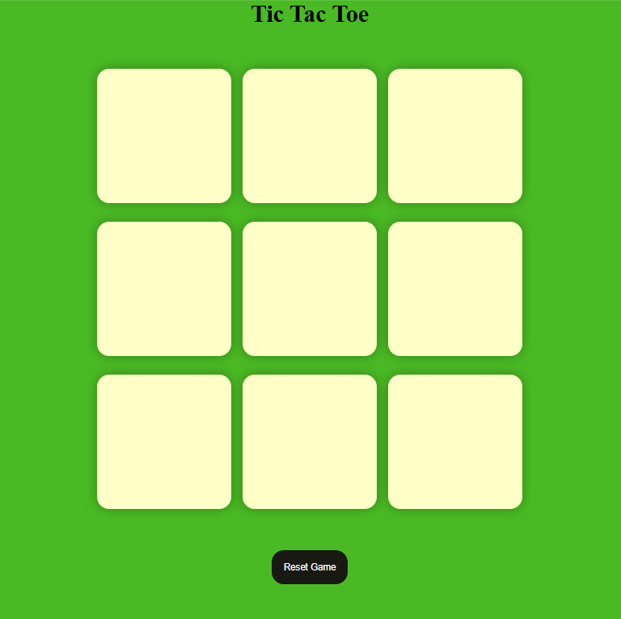
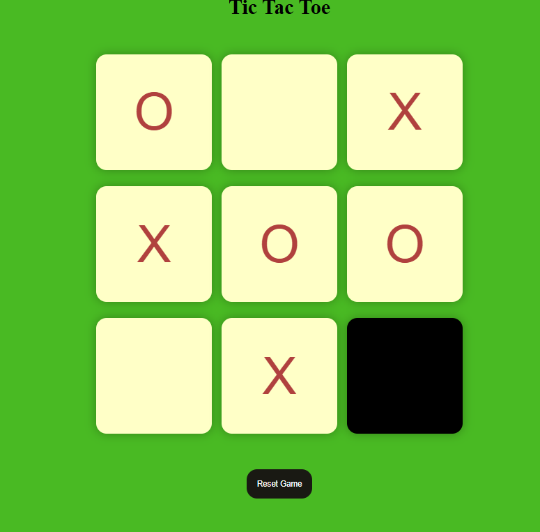

# 🎮 **Tic-Tac-Toe Game (HTML • CSS • JavaScript)**

An interactive and responsive **Tic-Tac-Toe web game** built using **HTML, CSS, and Vanilla JavaScript**.  
It features smooth animations, modern UI, instant win detection, and a quick replay feature.

Perfect for portfolios, web dev practice, and beginners learning front-end development.

---

## 🚀 Features

- 🎯 **Two Player Gameplay (X vs O)**
- ⚡ **Responsive & Lightweight**
- 🎨 **Modern UI + Smooth CSS Animations**
- 🧠 **Smart Win / Draw Detection**
- 🔁 **Restart Game Button**
- 📱 **Fully Responsive for All Devices**
- 🧩 **Pure HTML + CSS + JavaScript — No Libraries**

---

## 🖼️ Output Screenshots

Below are **three UI previews** of the game, stored inside the `IMAGES/` folder:

<p align="center">
  
</p>

<p align="center">
  
</p>

<p align="center">
  
</p>

> Make sure your files are named:  
> `output1.png`, `output2.png`, `output3.png` inside the **IMAGES/** folder.

---

## 🛠️ Tech Stack

- **HTML5** → Structure  
- **CSS3** → Styling + Animations  
- **JavaScript** → Game Logic  

---

## 📦 Installation & Setup

### 1️⃣ Clone the Repository

```bash
git clone https://github.com/VedantSatkar/Tic-Tac-Toe-Game.git
cd Tic-Tac-Toe-Game
````

### 2️⃣ Run the Game

Open this file in any browser:

```text
INDEX.HTML
```

Or use **Live Server** in VS Code:

```text
Right Click → Open with Live Server
```

---

## ▶️ Gameplay Instructions

* Player **X** starts the game
* Players tap on an empty box to place **X** or **O**
* Auto-detects:

  * ✔ Row Wins
  * ✔ Column Wins
  * ✔ Diagonal Wins
  * ✔ Draws
* Click **Restart** to reset the board and play again

---

## 💫 CSS Animations Included

* ⭐ **Box Click Pop Animation**
* ⭐ **Winning Cell Pulse Animation**
* ⭐ **Board Fade-In Animation**
* ⭐ **Restart Button Glow Animation**
* ⭐ **Player Turn Glow Animation**

These animations give the game a clean, modern, and premium feel.

---

## 📁 Project Structure

```text
Tic-Tac-Toe-Game/
│
├── INDEX.HTML
├── STYLE.CSS
├── APP.JS
└── IMAGES/
     ├── output1.png
     ├── output2.png
     └── output3.png
```


---

## 💡 Customization Options

You can modify:

* 🎨 **Colors** → in `STYLE.CSS`
* 😎 **Player Icons (X / O)**
* 🔊 **Sound Effects**
* 🤖 **Add an AI mode (Minimax)**
* 📱 **Improve UI responsiveness**

Example — change turn text color:

```css
.turn-indicator {
  color: #00e1ff;
}
```

---

## 🤝 Contributing

Contributions are welcome! You can:

1. Improve UI
2. Add animations
3. Add sound effects
4. Build an AI opponent
5. Submit a pull request 🚀

---

## 📬 Contact

**Vedant Satkar**
📧 [vedantssatkar@gmail.com](mailto:vedantssatkar@gmail.com)
🔗 [LinkedIn](https://linkedin.com/in/vedant-satkar-731bb2298)
💻 [GitHub](https://github.com/VedantSatkar)

---

## 📜 License

This project is licensed under the **MIT License**.
Free to use, modify, and share.
